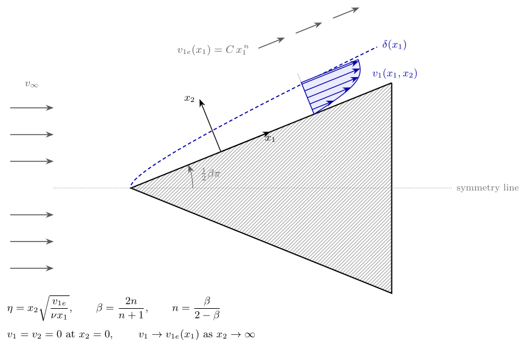
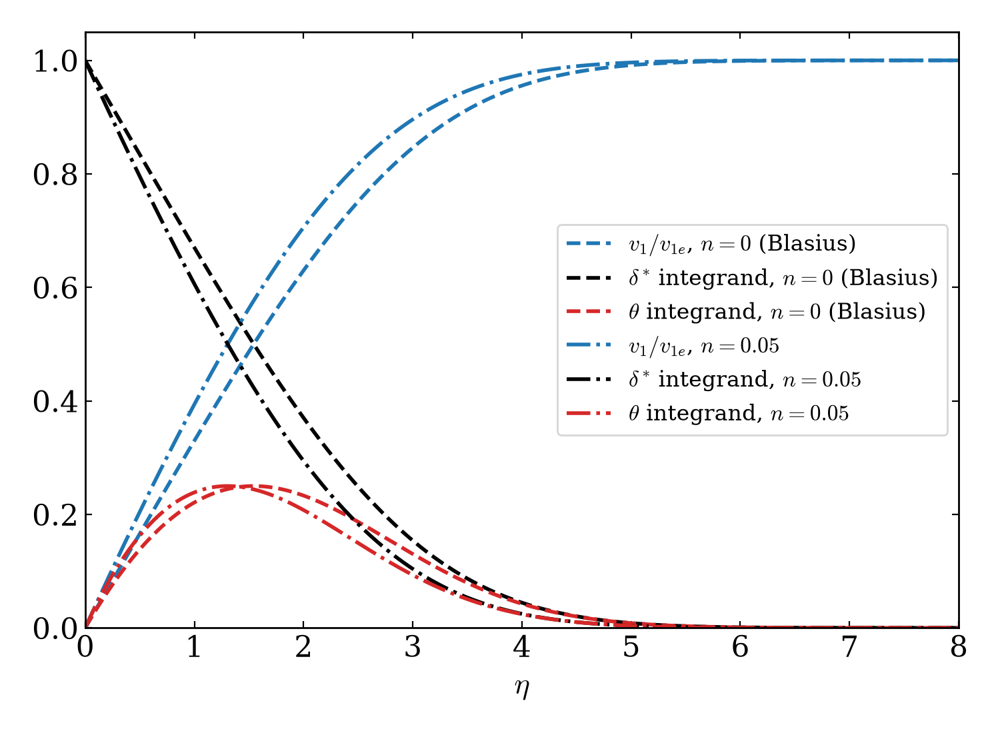
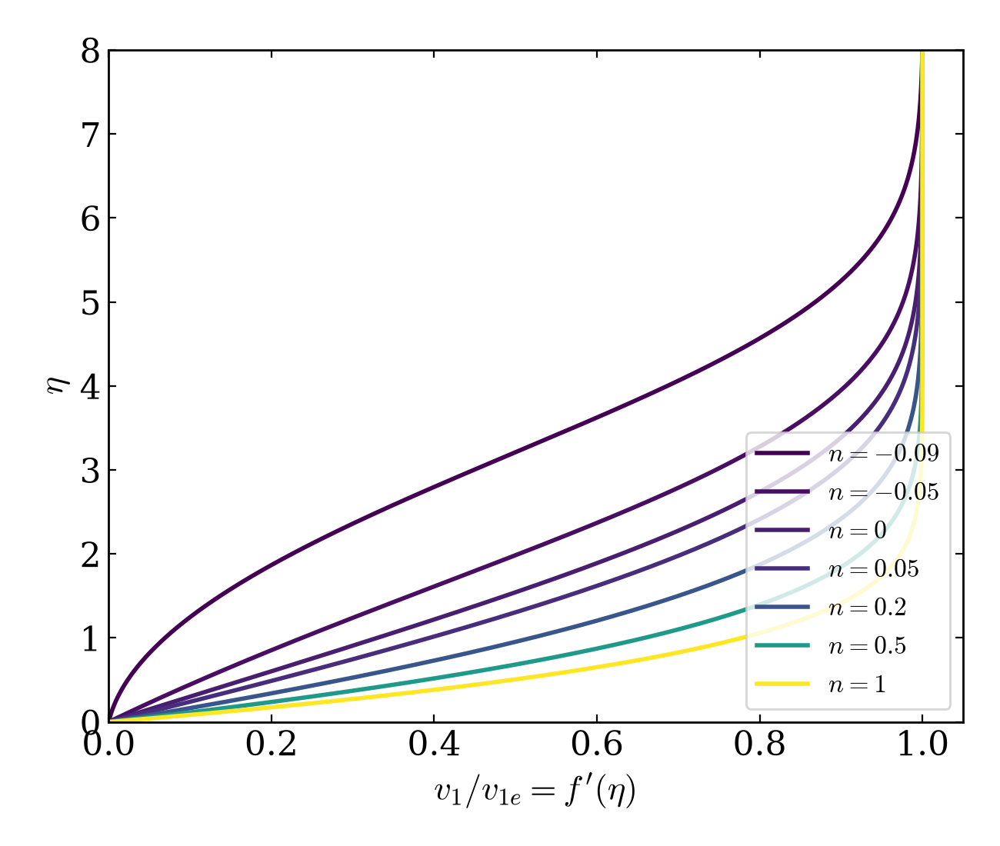
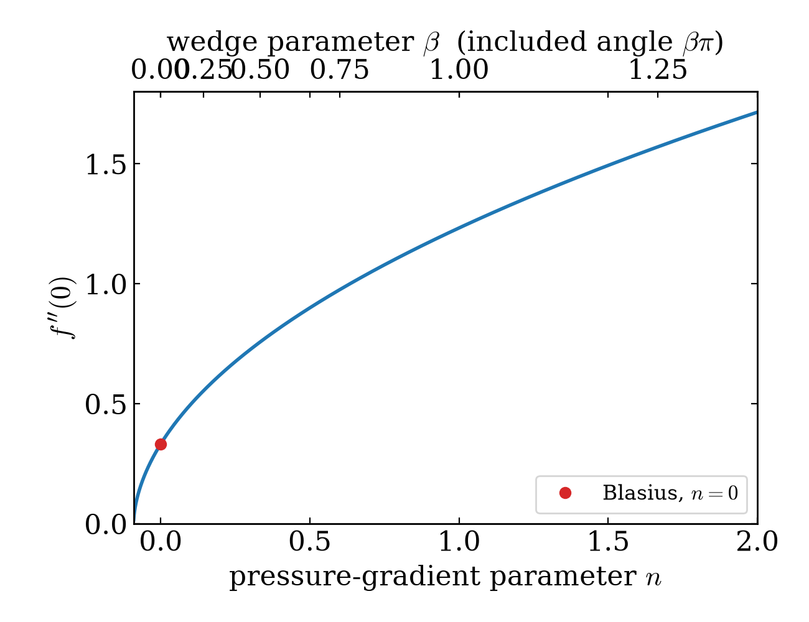

# Falkner–Skan Boundary-Layer Solver

A fast, compiled Python solver for the **Falkner–Skan equation**, which
describes the laminar boundary layer over a wedge. The classical **Blasius
flat plate** is the special case $n = 0$. Educational code, suitable for an
introductory course in fluid mechanics or boundary layers.



A uniform stream of speed $v_\infty$ meets a symmetric wedge of included angle
$\beta\pi$. Along the wedge face a laminar boundary layer of thickness
$\delta(x_1)$ grows, driven by the external velocity
$v_{1e}(x_1) = C\,x_1^{\,n}$. Because that edge velocity is a power law, the
velocity profiles at every station collapse onto a single curve when plotted
against the similarity coordinate $\eta$ — which is what reduces a partial
differential equation to an ordinary one.

*(The figure is drawn with TikZ; the source is
[`docs/figures/geometry.tex`](docs/figures/geometry.tex) and is also listed in
[the theory notes](docs/theory.md#8-problem-geometry-tikz-source).)*

## The equation

Starting from the incompressible Navier–Stokes equations and applying the
boundary-layer approximation and a similarity transformation — the full
derivation is in [`docs/theory.md`](docs/theory.md) — the problem reduces to a
single third-order nonlinear ODE:

$$
f''' + \frac{n+1}{2}\, f f'' - n f'^2 + n = 0,
\qquad
f(0) = f'(0) = 0,
\qquad
f'(\infty) = 1,
$$

where $f'(\eta) = v_1 / v_{1e}$ is the dimensionless velocity and $n$ is the
pressure-gradient parameter, related to the wedge angle by

$$
n = \frac{\beta}{2 - \beta},
\qquad
\beta = \frac{2n}{n+1} .
$$

$n > 0$ is a favourable (accelerating) pressure gradient, $n = 0$ the flat
plate, and $n < 0$ an adverse one; the boundary layer separates at
$n \approx -0.0904$.

**Reference:** Kundu, P. K. and Cohen, I. M., *Fluid Mechanics*, 4th edition.

## Install

```bash
git clone https://github.com/mrodrig6/basic_faulkner_skan.git
cd basic_faulkner_skan
pip install -e .
```

The only hard requirements are NumPy and Matplotlib. Numba is optional but
strongly recommended — it is what makes the solver fast. Without it the
package falls back to SciPy's compiled integrator and still gives identical
answers, just more slowly.

```bash
pip install -e ".[fast]"   # numba + scipy
pip install -e ".[dev]"    # + pytest
```

## Quick start

```python
from falkner_skan import solve

blasius = solve(0.0)                 # flat plate
print(blasius.wall_shear)            # 0.33205919  (f''(0))
print(blasius.shape_factor)          # 2.59115     (H = delta*/theta)

wedge = solve(0.05, fpp0=blasius.wall_shear)   # mild favourable gradient
print(wedge.eta, wedge.fp)                     # eta and v_1/v_1e
```

From the command line:

```bash
python -m falkner_skan -n 0 0.05            # the two cases of the old example
python -m falkner_skan -n 0.2 --csv out/    # write the profile as CSV
python -m falkner_skan --figures            # regenerate figures/
```

Jumping to an `n` far from your starting guess can converge on a non-physical
root, so for anything but a small step use continuation:

```python
from falkner_skan import solve_continuation, sweep
import numpy as np

stagnation = solve_continuation(1.0)         # walks n across in small steps
shear, residual, iters = sweep(np.linspace(0.0, 2.0, 401))
```

See [`docs/numerics.md`](docs/numerics.md) for why, and for how to choose
`eta_max`.

## Figures

`python -m falkner_skan.figures` regenerates everything in `figures/`.
Add `--geometry` to recompile the TikZ sketch as well (needs `pdflatex` and
`pdftocairo`).

| | |
|---|---|
|  |  |
| **`velocity_profiles.png`** — the figure the original MATLAB example drew: velocity $f'$, the displacement-thickness integrand $1 - f'$, and the momentum-thickness integrand $f'(1 - f')$, for $n = 0$ and $n = 0.05$. | **`profile_family.png`** — how the profile fills out under a favourable gradient and thins towards separation under an adverse one. |



**`wall_shear.png`** — $f''(0)$ against $n$ over 600-odd wedge angles, falling
to zero at separation. The whole sweep takes a few milliseconds.

## How the solver works

The boundary-value problem is turned into an initial-value problem by guessing
the wall shear stress $f''(0)$. The solver then

1. integrates the ODE from $\eta = 0$ to $\eta_{\max}$ with an adaptive
   Dormand–Prince 5(4) Runge–Kutta pair,
2. checks the outer condition $f'(\eta_{\max}) = 1$,
3. updates the guess with a secant step, and repeats until the residual is
   below $10^{-8}$.

Both the integrator and the secant loop are compiled to machine code with
Numba, which makes a single solve about 200x faster than the equivalent
interpreted Python, and a parameter sweep about 140x faster
(`python examples/benchmark.py`). Full detail — including the divergence
guards and backtracking that the original MATLAB version lacked — is in
[`docs/numerics.md`](docs/numerics.md).

## Repository layout

| Path | Description |
|---|---|
| `falkner_skan/_kernels.py` | Compiled core: ODE right-hand side, Dormand–Prince integrator with dense output, secant shooting loop, parameter sweep. |
| `falkner_skan/solver.py` | Public API — `solve`, `solve_continuation`, `sweep`, `FalknerSkanSolution`. |
| `falkner_skan/plotting.py` | The figures, styled to match the original MATLAB output. |
| `falkner_skan/figures.py` | `python -m falkner_skan.figures` — regenerates every figure, TikZ included. |
| `falkner_skan/cli.py` | `python -m falkner_skan` — solve, print, write CSV or figures. |
| `examples/example_profiles.py` | Port of the original `s_example_code.m`. |
| `examples/benchmark.py` | Compiled vs. pure-Python timings. |
| `docs/theory.md` | Navier–Stokes to Falkner–Skan, in full. |
| `docs/numerics.md` | Shooting, the compiled kernels, and how to choose the parameters. |
| `docs/figures/geometry.tex` | TikZ source for the geometry sketch. |
| `tests/` | `pytest` suite, checked against textbook values. |

## Tests

```bash
pytest
```

The suite pins the solver against published values — Blasius
$f''(0) = 0.332057$, $\delta^* = 1.72079$, $\theta = 0.66411$; Hiemenz
$f''(0) = 1.232588$ — checks the dense-output interpolant against SciPy, and
verifies that the profiles it returns are physical.

## License

This project is licensed under the GNU General Public License v3.0 — see the
[LICENSE](LICENSE) file for details.
